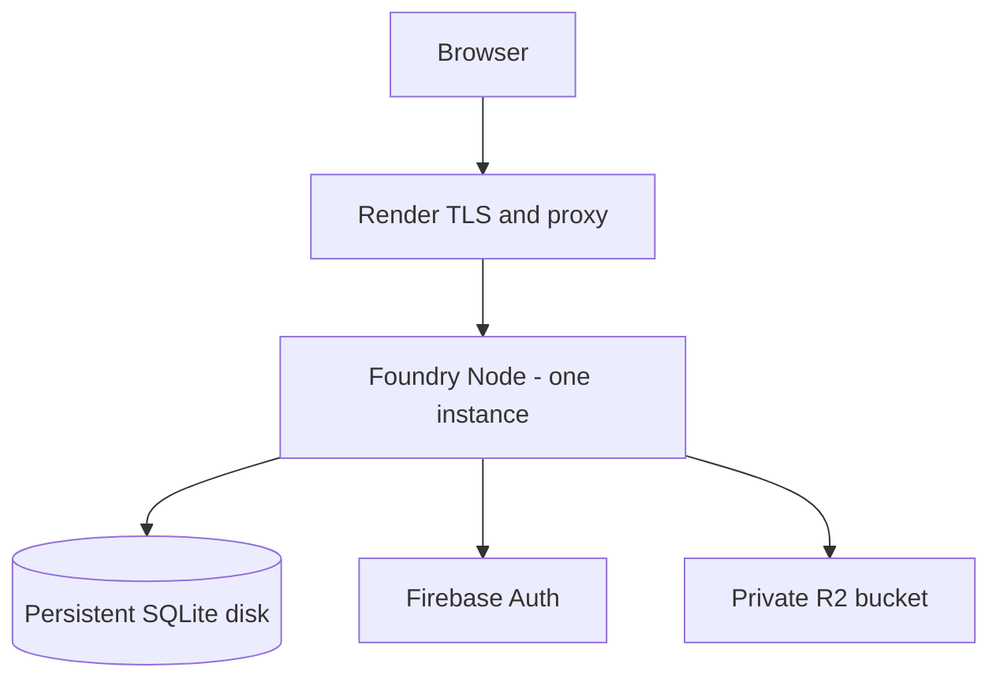

# Foundry staging deployment plan

Updated: 2026-08-27

Status: `STAGING DEPLOYMENT READY — USER ACTION REQUIRED`

This plan selects a concrete hosting target and turns the current Foundry RC into an operator-executable deployment procedure. It does not claim that any cloud resource exists or that any check has run against staging.

## 1. Chosen target

### Recommended staging target

**Render paid Web Service, native Node runtime, one Standard instance, one attached 5 GB persistent disk.**

Initial public origin:

```text
https://RENDER_SERVICE_NAME.onrender.com
```

Choose a unique `RENDER_SERVICE_NAME` that contains the word `staging`, for example `foundry-staging-TEAM`. This lets the checked-in staging smoke guard recognize the host without the production-risk override. A custom `https://staging.DOMAIN` can be added after the first acceptance pass; it is not required to establish real staging.

Recommended service settings:

| Setting | Staging value |
| --- | --- |
| Service type | Web Service |
| Runtime | Native Node |
| Node | `24.19.0` |
| Instance type | Standard, 2 GB RAM |
| Instances | Exactly 1 |
| Region | Nearest supported Render region to the intended staging users; record the selected region before creation |
| Persistent disk | 5 GB mounted at `/var/data/foundry` |
| SQLite | `/var/data/foundry/platform.db` |
| Build command | `npm ci && npm run verify:firebase-config && npm run build && npm run verify:artifact` |
| Start command | `npm start -w @foundry/platform` |
| Health check | `/api/ready` |
| Auto-deploy | Off until staging acceptance and rollback rehearsal complete |
| Pre-deploy command | None; Render pre-deploy compute cannot access the attached disk |
| App shutdown grace | `SHUTDOWN_GRACE_MS=20000` under Render's 30-second default termination window |

The Standard instance is a conservative staging choice for ZIP validation/extraction and the Node process. Current pricing observed on 2026-08-27 is approximately USD 25/month for the 2 GB instance plus USD 1.25/month for a 5 GB disk, before bandwidth/build overages. Re-size vertically only from measured staging memory data.

### Why this target

Render's attached disk is available to one service instance only and prevents horizontal scaling. That platform constraint matches Foundry's SQLite single-writer invariant instead of relying only on operator discipline. Render also supplies a native Node runtime, managed TLS and HTTP-to-HTTPS redirect, environment variables and runtime secret files, HTTP health checks, SIGTERM shutdown, deploy rollback, logs, metrics, and SSH/SCP access.

The cost is brief deployment downtime: Render stops the disk-backed instance before starting the replacement. That is acceptable for this staging and first-release single-node topology.



Browser package uploads use signed PUT URLs directly to the private R2 bucket. Public game reads use Foundry `/api/cdn/*`, not a public R2 hostname.

### Viable alternatives considered

| Requirement | Render | Fly.io | Railway |
| --- | --- | --- | --- |
| Node support | Native Node | Docker/Fly Launch | Node build/deploy support |
| Persistent storage | Attached SSD disk | Host-local Fly Volume | Attached volume |
| Single-replica safety | Disk-backed service cannot scale past one instance | Must explicitly keep one Machine; volumes are not shared | One instance by default, but replicas remain operator-configurable |
| HTTPS/custom domain | Managed TLS and automatic HTTP redirect | Managed certificates and proxy | Automatic SSL and custom domains |
| Secrets | Environment variables and `/etc/secrets/*` files | Fly secrets | Service/environment variables |
| Graceful shutdown | SIGTERM; default 30 seconds | Configurable signal/timeout | SIGTERM; draining defaults to zero unless configured |
| Backup access | Runtime shell plus SSH/SCP | SSH/SFTP and volume snapshots | Volume backups and shell access |
| Rollback | Reuses retained build artifact; disk is not rolled back | Redeploy a retained prior image | Roll back/redeploy an eligible prior deployment |
| Logging | Built-in logs/metrics and email/Slack failure notifications | CLI/platform logs | Built-in logs |
| Cost model | Fixed instance plus disk | Usage plus volume/snapshot | Usage with plan minimum plus volume |
| Operational complexity | Lowest for this RC | Higher: Docker, Machines, volume placement, CLI | Low, but replica and shutdown invariants need extra explicit controls |
| SQLite suitability | Best match for intentional one-node staging | Suitable only with one Machine and recovery discipline | Suitable only with one replica and configured drain time |

Render is selected because it enforces the most important invariant structurally while requiring no Dockerfile, cluster layer, or provider-specific application logic.

Provider facts used for this decision:

- [Render persistent disks](https://render.com/docs/disks)
- [Render web services and TLS termination](https://render.com/docs/web-services)
- [Render health checks](https://render.com/docs/health-checks)
- [Render deploy shutdown](https://render.com/docs/deploys)
- [Render rollbacks](https://render.com/docs/rollbacks)
- [Render environment variables and secret files](https://render.com/docs/configure-environment-variables)
- [Fly Volumes](https://fly.io/docs/volumes/overview/)
- [Fly application configuration](https://fly.io/docs/reference/configuration/)
- [Railway volumes](https://docs.railway.com/volumes/reference)
- [Railway deployment teardown](https://docs.railway.com/deployments/deployment-teardown)

## 2. Requirements derived from current code

| Area | Current requirement | Source of truth |
| --- | --- | --- |
| Node | Node `>=22`; staging pins the locally verified `24.19.0` | root `package.json` |
| Process model | One `node dist/server.cjs` process; background jobs run in the same process against SQLite | `apps/platform/package.json`, `server.js` |
| Bind | `0.0.0.0:$PORT`; Render staging uses port `10000` | `server.js`, production validator |
| Client artifact | `apps/platform/dist/client` only | `server.js`, artifact verifier |
| Server artifact | `apps/platform/dist/server.cjs` | platform build script |
| SQLite | Absolute non-root file path; parent must already exist and be readable/writable | `productionConfig.js` |
| Replicas | Exactly one application instance and one SQLite writer | current SQLite/job architecture |
| Firebase client | Four required `VITE_FIREBASE_*` values embedded at build time | `vite.config.js`, `AuthContext.jsx` |
| Firebase Admin | `FIREBASE_PROJECT_ID` plus an existing absolute ADC credential file or deliberate ADC mode | `productionConfig.js`, `firebaseAdmin.js` |
| Firebase identity binding | Built `deployment-profile.json` project must equal runtime `FIREBASE_PROJECT_ID` | `vite.config.js`, `productionConfig.js` |
| Firestore | Checked-in rules target the exact named database in `firebase.json` | `firebase.json`, `verify-firebase-config.mjs` |
| R2 | Private bucket, account endpoint, scoped read/write/list/delete credentials | `R2StorageProvider.js` |
| Upload | Browser uses signed PUT; R2 CORS must allow the exact staging origin and `Content-Type` | upload service, R2 verifier |
| Public delivery | `R2_DIRECT_DOWNLOADS=false`; reads pass through `/api/cdn/*` and moderation state | production validator, `app.js` |
| Proxy | Explicit bounded `TRUST_PROXY_HOPS` from 0 to 3 | production validator, `app.js` |
| HTTPS | `PLATFORM_PUBLIC_BASE_URL` must be an exact HTTPS origin | production validator |
| Liveness | `GET /api/health` returns process liveness | `app.js` |
| Readiness | `GET /api/ready` checks SQLite, R2, jobs, and Firebase Admin | `app.js` |
| Shutdown | SIGTERM/SIGINT stops admission and scheduling, drains jobs/SQLite, then closes DB | `server.js` |
| Production safety | E2E/local/auth/readiness bypasses, inline jobs, and direct R2 downloads are forbidden | runtime and production validators |

No application source change is required for Render. `packages/engine/src/engine/core` remains untouched.

## 3. Required accounts and resources

Create these resources before the first deploy:

1. A private GitHub, GitLab, or Bitbucket repository containing this exact RC tree. The supplied workspace has no Git metadata; do not attempt to reconstruct old history.
2. A Render project with a `Staging` environment and one paid Web Service.
3. A dedicated Firebase staging project with a Web app, Google sign-in, the exact named Firestore database, three disposable identities, and one runtime service-account key.
4. A dedicated private Cloudflare R2 staging bucket and a bucket-scoped Object Read & Write token.
5. An operator-controlled encrypted backup location outside the Render disk, plus an email or Slack destination for Render failure notifications.

Do not use production Firebase users, a production R2 bucket, or a shared production prefix. Foundry has no runtime variable for a global R2 namespace, so environment isolation must be a separate bucket.

## 4. Environment matrix

All names below come from the current repository or the selected Render runtime. Values marked `REPLACE_*` are operator inputs, not literal values.

### Provider, build, and core runtime

| Variable | Build/runtime | Secret? | Source | Required staging value |
| --- | --- | --- | --- | --- |
| `NODE_VERSION` | Build/runtime | No | Render native Node setting | `24.19.0` |
| `NODE_ENV` | Runtime | No | `productionConfig.js` | `production` |
| `PORT` | Runtime | No | `server.js` | `10000` |
| `HOST` | Runtime | No | `server.js` | `0.0.0.0` |
| `PLATFORM_PUBLIC_BASE_URL` | Runtime | No | `productionConfig.js` | Exact `https://RENDER_SERVICE_NAME.onrender.com` origin, no trailing slash |
| `PLATFORM_CLIENT_BUILD_PROFILE` | Runtime | No | `productionConfig.js` | `/opt/render/project/src/apps/platform/dist/client/deployment-profile.json` |
| `PLATFORM_DB_PATH` | Runtime | Sensitive operational path, not a credential | `productionConfig.js` | `/var/data/foundry/platform.db` |

### Firebase browser/public build values

| Variable | Build/runtime | Secret? | Source | Required staging value |
| --- | --- | --- | --- | --- |
| `VITE_FIREBASE_API_KEY` | Build | No; Firebase Web identifier | `vite.config.js`, `AuthContext.jsx` | Web app value from the staging Firebase project |
| `VITE_FIREBASE_AUTH_DOMAIN` | Build | No | same | Staging Web app auth domain |
| `VITE_FIREBASE_PROJECT_ID` | Build | No | same | Dedicated staging project ID |
| `VITE_FIREBASE_APP_ID` | Build | No | same | Staging Web app ID |
| `VITE_FIREBASE_STORAGE_BUCKET` | Build, optional in code | No | `AuthContext.jsx` | Staging Web app value if present |
| `VITE_FIREBASE_MESSAGING_SENDER_ID` | Build, optional in code | No | `AuthContext.jsx` | Staging Web app value if present |

Never put server credentials in a `VITE_*` variable. The existing `firebase-applet-config.json` is development-only; its legacy public project identity is not the production build source.

### Firebase server and rules mapping

| Variable | Build/runtime | Secret? | Source | Required staging value |
| --- | --- | --- | --- | --- |
| `FIREBASE_PROJECT_ID` | Build verification/runtime | No | production validator and verifier | Exactly the same value as `VITE_FIREBASE_PROJECT_ID` |
| `FIRESTORE_DATABASE_ID` | Build/operator verifier | No | `firebase.json`, verifier | `ai-studio-foundryengine-2c0d9198-817d-437d-8b2b-d5a59c60420c` |
| `GOOGLE_APPLICATION_CREDENTIALS` | Runtime | Path is not secret; file contents are secret | production validator | `/etc/secrets/firebase-admin.json` |
| `FIREBASE_USE_APPLICATION_DEFAULT_CREDENTIALS` | Runtime | No | production validator | `false` when using the secret file |

Create the Render secret file as `firebase-admin.json`; paste its contents directly in Render. Never commit it, add it to `.env`, or paste it into a report/chat.

### R2 runtime

| Variable | Build/runtime | Secret? | Source | Required staging value |
| --- | --- | --- | --- | --- |
| `R2_ACCOUNT_ID` | Runtime/operator verifier | Operational identifier | R2 provider/validator | 32-character staging Cloudflare account ID |
| `R2_ACCESS_KEY_ID` | Runtime/operator verifier | Yes | R2 provider | Bucket-scoped access key ID |
| `R2_SECRET_ACCESS_KEY` | Runtime/operator verifier | Yes | R2 provider | Bucket-scoped secret access key |
| `R2_BUCKET_NAME` | Runtime/operator verifier | Operational identifier | R2 provider | Dedicated private staging bucket |
| `R2_ENDPOINT` | Runtime/operator verifier | No | production validator | `https://R2_ACCOUNT_ID.r2.cloudflarestorage.com` with the real account ID |
| `R2_UPLOAD_URL_TTL_SECONDS` | Runtime | No | production validator | `900` |
| `R2_DIRECT_DOWNLOADS` | Runtime | No | production validator | `false` |
| `R2_DOWNLOAD_URL_TTL_SECONDS` | Runtime | No | production validator | `120` |

### Jobs, security, observability, and limits

| Variable | Build/runtime | Secret? | Source | Required staging value |
| --- | --- | --- | --- | --- |
| `JOB_MODE` | Runtime | No | production validator | `async` |
| `JOB_WORKER_ID` | Runtime | No | job queue | `foundry-staging-1` |
| `JOB_LEASE_MS` | Runtime | No | production validator | `60000` |
| `MAX_JOB_ATTEMPTS` | Runtime | No | production validator | `3` |
| `MAX_PUBLISH_ATTEMPTS` | Runtime | No | production validator | `3` |
| `UPLOAD_CLEANUP_INTERVAL_MS` | Runtime | No | server/validator | `900000` |
| `UPLOAD_SESSION_EXPIRATION_MS` | Runtime | No | production validator | `86400000` |
| `COMPLETED_UPLOAD_RETENTION_MS` | Runtime | No | production validator | `604800000` |
| `CORS_ALLOWED_ORIGINS` | Runtime | No | production validator/app | Omit or empty for the same-origin Platform API |
| `TRUST_PROXY_HOPS` | Runtime | No | production validator/app | `1` for the planned Render load-balancer-to-app topology; staging spoof test must confirm it |
| `ENABLE_HSTS` | Runtime | No | security headers | `false` for first deploy; change to `true` only after HTTPS/redirect verification |
| `E2E_MODE` | Runtime | No | runtime validator | `false` |
| `LOCAL_DEV_MODE` | Runtime | No | runtime validator | `false` |
| `AUTH_DEV_BYPASS` | Runtime | No | runtime validator | `false` |
| `ALLOW_UNREADY_STARTUP` | Runtime | No | production validator | `false` |
| `SHUTDOWN_GRACE_MS` | Runtime | No | production validator/server | `20000` |
| `LOG_LEVEL` | Runtime | No | production validator/logger | `info` |
| `PLATFORM_MAX_STORAGE_BYTES_PER_USER` | Runtime | No | quota config | `1073741824` |
| `PLATFORM_MAX_ACTIVE_UPLOADS_PER_USER` | Runtime | No | quota config | `10` |
| `PLATFORM_MAX_GAME_VERSIONS_PER_USER` | Runtime | No | quota config | `100` |
| `PLATFORM_MAX_PACKAGE_SIZE_BYTES` | Runtime | No | quota config | `52428800` |
| `PLATFORM_MAX_FILES_PER_PACKAGE` | Runtime | No | quota config | `1000` |
| `PLATFORM_MAX_EXTRACTED_FILES_PER_PACKAGE` | Runtime | No | quota config | `1000` |
| `PLATFORM_MAX_TOTAL_EXTRACTED_SIZE_BYTES` | Runtime | No | quota config | `104857600` |
| `PLATFORM_MAX_FILE_SIZE_BYTES` | Runtime | No | quota config | `20971520` |

### Secure operator-only verifier values

These belong in a local secure operator terminal, never in Render's persistent service environment and never in the repository.

| Variable | Build/runtime | Secret? | Source | Required staging value |
| --- | --- | --- | --- | --- |
| `STAGING_BASE_URL` | Operator verifier | No | Firebase/staging smoke scripts | Exact deployed HTTPS origin |
| `STAGING_FIREBASE_OWNER_TOKEN` | Operator verifier | Yes, short-lived | Firebase verifier | User A ID token |
| `STAGING_FIREBASE_FOREIGN_TOKEN` | Operator verifier | Yes, short-lived | Firebase verifier | Distinct User B ID token |
| `FIREBASE_STAGING_RULES_CONFIRM` | Operator verifier | No | Firebase verifier | Exact confirmation string printed by the script |
| `R2_STAGING_TEST_PREFIX` | Operator verifier | No | R2 verifier | `staging-verification/foundry-rc` |
| `R2_STAGING_CORS_ORIGIN` | Operator verifier | No | R2 verifier | Exact deployed HTTPS origin |
| `R2_STAGING_VERIFY_CONFIRM` | Operator verifier | No | R2 verifier | Exact confirmation string printed by the script |
| `STAGING_DEVELOPER_TOKEN` | Operator verifier | Yes, short-lived | staging smoke | Developer A ID token |
| `STAGING_MODERATOR_TOKEN` | Operator verifier | Yes, short-lived | staging smoke | Distinct provisioned operator ID token |
| `STAGING_TEST_PACKAGE` | Operator verifier | No | staging smoke | Absolute path to `apps/platform/e2e/fixtures/generic-valid-game.zip` |
| `STAGING_SMOKE_CONFIRM` | Operator verifier | No | staging smoke | Exact confirmation string printed by the script |
| `STAGING_ALLOW_NON_STAGING_HOST` | Operator verifier | No | staging smoke | Leave unset because the chosen service hostname contains `staging` |
| `FOUNDRY_BACKUP_OUTPUT` | Operator convenience only | Sensitive path, not credential | DB backup script | Optional; prefer an explicit `--output` path |

## 5. Firebase setup

1. Create a dedicated Firebase project. Record its project ID; do not reuse the project represented by CI placeholders or the development-only bundled config.
2. Add a Web app and copy its public Web configuration into the six `VITE_FIREBASE_*` Render values.
3. In Authentication, enable Google sign-in.
4. Add `RENDER_SERVICE_NAME.onrender.com` to Authentication -> Authorized domains. Add a future custom staging hostname only when it exists.
5. Create a Firestore Native Mode database with the exact ID:

   ```text
   ai-studio-foundryengine-2c0d9198-817d-437d-8b2b-d5a59c60420c
   ```

   Database ID and location are immutable choices. Select a location appropriate to the chosen Render region and record both.
6. Create three distinct disposable identities: Developer A, Developer B/non-owner, and Moderator/Admin.
7. Create a dedicated staging runtime service account. Do not grant Owner/Editor merely for convenience. Rules deployment must use the operator's Firebase CLI identity, not the runtime key.
8. Download the runtime JSON once and add it directly to Render as the secret file `firebase-admin.json`.
9. From a secure authenticated operator machine, deploy the checked-in rules exactly:

   ```bash
   cd apps/platform
   firebase deploy --only firestore --project "$FIREBASE_PROJECT_ID" --config firebase.json
   cd ../..
   npm run verify:firebase-config
   ```

10. After the application deploy, obtain short-lived ID tokens from two separate signed-in browser sessions. One safe method is to copy the Bearer token from each session's `/api/auth/me` request in browser developer tools into the secure operator shell. Do not record or transmit the token.
11. Run `npm run verify:staging:firebase` only after the real rules deployment and real Platform URL exist.
12. In addition to the current verifier, explicitly record two deployed-rules checks it does not perform: an unauthenticated Platform/Firestore request is denied, and User A can perform one valid update that preserves `ownerUid` and `createdAt`. Delete the disposable document afterward.

The live verifier checks Platform token verification, owner create/read/delete, list denial, foreign-user read denial, owner-UID forgery denial, and malformed-write denial. Preserve its JSON output without tokens.

## 6. R2 setup

1. Create a new private R2 bucket dedicated to staging. Do not enable an `r2.dev` public URL or custom public bucket domain.
2. Create an R2 API token with Object Read & Write access scoped only to this bucket. The current app and verifier require PUT, HEAD, GET/Range, list, and delete.
3. Record the 32-character account ID, access key ID, secret access key, bucket name, and exact account endpoint.
4. Configure this CORS policy, replacing the origin with the exact Render staging origin and omitting a trailing slash:

   ```json
   [
     {
       "AllowedOrigins": ["https://RENDER_SERVICE_NAME.onrender.com"],
       "AllowedMethods": ["PUT"],
       "AllowedHeaders": ["Content-Type"],
       "ExposeHeaders": ["ETag"],
       "MaxAgeSeconds": 3600
     }
   ]
   ```

5. Add the R2 values directly to the Render environment. Put the same scoped credentials only in the secure operator environment when running the R2 verifier.
6. Run `npm run verify:staging:r2`. It creates one random object only under `staging-verification/foundry-rc/`, validates signed PUT, CORS, HEAD metadata, full GET, ranged GET, signed GET, listing, deletion, and cleanup.

R2 CORS is needed for signed browser uploads. Direct R2 GET is not the public product contract; Foundry Player/CDN acceptance must use the deployed Platform origin.

## 7. Persistent SQLite setup

Render service configuration:

```text
Disk mount: /var/data/foundry
Disk size: 5 GB
Database:   /var/data/foundry/platform.db
```

Rules:

- The disk must be attached before startup. Production validation refuses to create a missing parent directory.
- Only data under `/var/data/foundry` persists. Do not place the DB under the repository checkout or `/tmp`.
- Keep exactly one service instance. Render enforces this while the disk is attached.
- Do not use a Render pre-deploy command or one-off job for DB migration/backup; those environments cannot see the disk.
- Run DB tools through the running service's Shell/SSH session.
- Keep at least enough free disk for the live DB, WAL, one new backup, and one isolated rehearsal copy. Treat 20% free as the operator warning threshold until measured staging growth supports a different threshold.

Backup flow after staging has representative data:

```bash
mkdir -p /var/data/foundry/backups
npm run db:backup -- \
  --source /var/data/foundry/platform.db \
  --output /var/data/foundry/backups/foundry-staging-YYYYMMDD-HHMM.db
npm run db:rehearse -- \
  --backup /var/data/foundry/backups/foundry-staging-YYYYMMDD-HHMM.db
```

Then transfer the verified backup off the Render disk using the SSH target shown by Render and SCP/SFTP. A second directory on the same disk is rehearsal space, not an external backup.

Do not restore a Render disk snapshot over the live SQLite DB. Use the checked-in WAL-safe backup/restore tools and always restore to a new filename.

## 8. TLS, proxy, and origin setup

Initial topology:

```text
Internet -> Render managed HTTPS/load balancer -> Foundry HTTP listener on 0.0.0.0:10000
```

Set `TRUST_PROXY_HOPS=1` for this planned single application-facing Render proxy hop. This is a configuration decision, not yet staging evidence. Acceptance must verify the observed `X-Forwarded-For`, protocol, client IP, and spoofed-header behavior through the real URL. If the observed chain differs, stop and set the measured bounded hop count; never use `trust proxy=true`.

First deploy:

- `PLATFORM_PUBLIC_BASE_URL` = exact Render HTTPS origin.
- `ENABLE_HSTS=false`.
- `CORS_ALLOWED_ORIGINS` omitted/empty because Platform API is same-origin.
- Firebase Authorized Domain = Render hostname without scheme.
- R2 AllowedOrigins = exact Render HTTPS origin.

Verify the certificate and automatic HTTP redirect. Then set `ENABLE_HSTS=true`, redeploy, and confirm `Strict-Transport-Security: max-age=31536000` from the real HTTPS origin.

For a later custom domain, add and verify it in Render first, then update Firebase Authorized Domains, R2 CORS, `PLATFORM_PUBLIC_BASE_URL`, and operator `STAGING_BASE_URL` as one coordinated change. Do not enable HSTS on an unverified hostname.

## 9. Build procedure

The existing `apps/platform/dist` is CI-bound to `foundry-ci-12345` and is forbidden as a staging artifact.

From a clean checkout of the exact RC commit:

1. Confirm Node `v24.19.0` and a clean source tree.
2. Set the staging public Firebase Web values and matching `FIREBASE_PROJECT_ID`/`FIRESTORE_DATABASE_ID` in the build environment. A standalone operator build does not need Firebase Admin or R2 secrets. Render makes service environment variables available during native builds by platform design, so its build command must neither consume nor print runtime credentials; `verify:artifact` remains mandatory.
3. Execute:

   ```bash
   npm ci
   npm run verify:firebase-config
   npm run build
   npm run verify:artifact
   ```

4. Verify the generated project identity:

   ```bash
   node -e 'const fs=require("node:fs");const p=JSON.parse(fs.readFileSync("apps/platform/dist/client/deployment-profile.json","utf8"));if(p.schemaVersion!==1||p.firebaseProjectId!==process.env.FIREBASE_PROJECT_ID)process.exit(1);console.log(JSON.stringify(p,null,2))'
   ```

5. Preserve the Render deploy/build identifier and the emitted profile JSON as non-secret evidence.

Render uses the same procedure through its build command. Because Render environment values are available during build, changing a `VITE_FIREBASE_*`, `FIREBASE_PROJECT_ID`, or `FIRESTORE_DATABASE_ID` value must use **Save, rebuild, and deploy**. Do not reuse an old build after changing project identity.

## 10. Exact deployment procedure

### A. Publish the RC source

The provided tree has no Git metadata. Create a new private repository; do not spend time reconstructing history.

```bash
git init
git status --short
git add .
git status --short
git commit -m "Foundry RC staging candidate"
git branch -M staging-rc
git remote add origin REPLACE_WITH_PRIVATE_GIT_URL
git push -u origin staging-rc
```

Before committing, confirm `.gitignore` excludes `node_modules`, `dist`, `.env`, local/E2E data, test output, logs, and SQLite files. Never add the Firebase Admin JSON or R2 credentials.

### B. Create the Render service

1. Create a Render project and a `Staging` environment.
2. Select **New -> Web Service** and connect the private repository/`staging-rc` branch.
3. Choose a unique service name containing `staging`; record the resulting exact `onrender.com` origin.
4. Select the intended region and native Node runtime.
5. Select the Standard 2 GB instance.
6. Set the build and start commands exactly as specified above.
7. Set Health Check Path to `/api/ready`.
8. Disable auto-deploy.
9. Attach a 5 GB disk at `/var/data/foundry`. Confirm the UI prevents more than one instance.
10. Add every required environment value from the matrix. Do not add operator-only tokens.
11. Add the secret file `firebase-admin.json`; set `GOOGLE_APPLICATION_CREDENTIALS=/etc/secrets/firebase-admin.json`.
12. Leave pre-deploy command empty and create the service.

### C. Confirm first startup

1. Watch build logs for successful Firebase mapping, Vite/server build, and artifact verification.
2. Watch runtime logs for production config validation, SQLite migration/open, readiness, `server_started`, and no secret values.
3. Run from an operator machine:

   ```bash
   curl -fsS https://RENDER_SERVICE_NAME.onrender.com/api/health
   curl -fsS https://RENDER_SERVICE_NAME.onrender.com/api/ready
   curl -fsS https://RENDER_SERVICE_NAME.onrender.com/deployment-profile.json
   ```

4. Require `/api/health=200`, `/api/ready=200`, and a deployment profile whose Firebase project equals the runtime project.
5. Verify HTTP redirects to HTTPS, the certificate is valid for the hostname, and required Platform/API/sandbox/CDN headers survive the proxy.
6. Set `ENABLE_HSTS=true`, redeploy, and re-check HTTPS plus HSTS.
7. Enable Render **Only failure notifications** to an operator email or Slack destination. This covers failed deploys and unhealthy service events.

No step above is complete until its real output is attached to the staging record.

## 11. Post-deploy acceptance order

Do not reorder these blocks without a recorded technical reason.

1. **Firebase live verification**
   - Deploy checked-in rules.
   - Confirm Authorized Domain and real sign-in.
   - Run `npm run verify:staging:firebase` with two distinct disposable users.
   - Separately require unauthenticated Platform/Firestore denial and one valid owner update, because the current verifier does not cover those two assertions.
   - Record project ID, database ID, deployment result, verifier JSON, and exit code without tokens.
2. **R2 live verification**
   - Run `npm run verify:staging:r2` against the dedicated bucket/prefix.
   - Require signed PUT, CORS, HEAD, GET, Range, list, delete, and cleanup PASS.
3. **TLS/proxy/header verification**
   - Verify HTTP redirect, certificate, protocol/client IP, spoofed `X-Forwarded-For`, rate-limit identity, HSTS, CSP, API/sandbox/CDN headers, mixed content, and absence of unexpected cookies.
4. **Persistent SQLite restart test**
   - Create a disposable resource, restart the one service instance, confirm the same row remains, and record disk path/usage.
5. **First operator provisioning**
   - In the Render service shell run:

     ```bash
     npm run admin:provision -- \
       --uid FIREBASE_OPERATOR_UID \
       --role MODERATOR \
       --db /var/data/foundry/platform.db \
       --confirm-provision
     ```

   - Preserve the JSON result without credentials; verify normal user denied and operator allowed.
6. **Full staging smoke**
   - Run `npm run test:staging` with Developer A, the provisioned operator, and the checked-in generic ZIP.
   - Preserve machine-readable JSON and require cleanup confirmation.
7. **Editor workflow**
   - Real Chromium: `/editor -> sign in -> project -> Save -> Send to Platform -> READY -> Project Manager -> publish -> Catalog -> Player`.
   - Verify refresh and protected deep-link persistence; collect console/page/network errors.
8. **Moderation drill**
   - Developer reports a disposable published game; operator hides/quarantines with a reason; verify audit UID/time/state and Catalog/Details/CDN denial; restore and verify Catalog/CDN return.
9. **SQLite backup**
   - Run the WAL-safe backup against the live staging DB and transfer it off-volume.
10. **SQLite restore rehearsal**
    - Run `db:rehearse`; never restore over the active DB.
11. **R2 storage integrity**
    - In the service shell run `PLATFORM_DB_PATH=/var/data/foundry/platform.db npm run storage:check`; investigate missing/invalid/orphan candidates without deletion.
12. **R2 recovery rehearsal**
    - Use an isolated object/prefix and the selected external byte-backup mechanism. This mechanism is not yet selected and remains a public-release blocker.
13. **Application rollback**
    - Follow the procedure below using a harmless revision and the same disk.
14. **Logs and alerts**
    - Inspect request/job/moderation/startup/shutdown logs for correlation and redaction; verify Render unhealthy/deploy-failure notifications; add an external disk/backup alert before public release.

## 12. Rollback

Render rollback restores a retained application build; it does not roll back the attached disk.

1. Record the current Render deploy ID, source commit, Firebase deployment profile, and DB migration set.
2. Create and rehearse a SQLite backup, then transfer it off-volume.
3. Deploy a harmless next revision with auto-deploy still disabled.
4. Confirm `/api/ready=200` and a published disposable game still launches.
5. In Render Events, select the preceding known-good deploy and choose **Rollback**.
6. Wait for `/api/ready=200`; verify the same DB rows and published game.
7. Do not perform a schema downgrade and do not restore the DB merely because the application artifact was rolled back.
8. Re-enable auto-deploy only after the rollback rehearsal and acceptance record are complete.

Because the service has a persistent disk, expect a short outage during deploy/rollback. If the prior build artifact has expired from Render retention, deploy the exact prior commit after confirming its Firebase build values and DB compatibility.

## 13. Operations and remaining public-release work

- Render logs and metrics provide staging startup/runtime evidence. Set failure notifications for failed deploys and unhealthy instances.
- Render displays disk usage, but the selected setup does not yet provide an automated low-disk or backup-failure alert. That remains a public-release blocker until an external alert destination is configured and tested.
- Render disk snapshots are not the SQLite recovery procedure. Use `db:backup`, off-volume transfer, and `db:rehearse`.
- Foundry/R2 byte recovery is still not selected. Before public release, choose an independently credentialed one-way backup/replication target, document RPO/RTO/retention/cost, and rehearse restoration. Do not use a mirror operation that propagates primary deletions before retention expires.
- R2 durability does not recover deliberate or accidental deletion. The primary application bucket must remain deletable for Foundry lifecycle jobs, so a primary-bucket lock is not a substitute for an external byte backup.

## 14. User Action Required

### 1. Publish the current RC to a private Git repository

**WHAT:** Create a new private Git repository/`staging-rc` branch from this exact tree.  
**WHY:** Render requires a connected source repository, and this workspace contains no Git metadata.  
**WHERE TO CREATE/GET IT:** GitHub, GitLab, or Bitbucket.  
**SECRET OR PUBLIC:** Repository access is private; no runtime secret belongs in the repository.  
**WHAT TO DO WITH IT:** Connect the repository and branch to the Render staging service; verify ignored artifacts before the first commit.

### 2. Create the dedicated Firebase staging resources

**WHAT:** Firebase project, Web app, exact named Firestore database, Google provider, Authorized Domain, Developer A/B plus operator identities, and runtime service-account JSON.  
**WHY:** Build identity, real auth, deployed ownership rules, and two-user verification all require a real project.  
**WHERE TO CREATE/GET IT:** Firebase Console and Google Cloud IAM; deploy rules from a secure Firebase CLI session.  
**SECRET OR PUBLIC:** Web config/project/database IDs are public identifiers; service-account JSON and ID tokens are secret.  
**WHAT TO DO WITH IT:** Put public values in Render environment variables, the JSON directly in Render secret file `firebase-admin.json`, and short-lived tokens only in the secure operator shell.

### 3. Create the dedicated private R2 staging bucket

**WHAT:** One private bucket, a bucket-scoped Object Read & Write token, and the exact CORS policy from this plan.  
**WHY:** Upload, validation, publish, Range delivery, lifecycle cleanup, and moderation must use real private object storage.  
**WHERE TO CREATE/GET IT:** Cloudflare Dashboard -> R2.  
**SECRET OR PUBLIC:** Bucket/account/endpoint are operational identifiers; access key and secret key are secrets.  
**WHAT TO DO WITH IT:** Add credentials directly to Render and the secure verifier environment; never enable public bucket access or use production data.

### 4. Create and deploy the Render staging service

**WHAT:** One Standard native-Node Web Service, selected region, 5 GB `/var/data/foundry` disk, exact build/start/health settings, environment matrix, and Firebase secret file.  
**WHY:** This is the selected architecture that structurally preserves the one-instance SQLite invariant.  
**WHERE TO CREATE/GET IT:** Render Dashboard in a dedicated `Staging` environment.  
**SECRET OR PUBLIC:** Service URL is public; environment secrets and secret-file contents remain in Render.  
**WHAT TO DO WITH IT:** Keep auto-deploy off, deploy, enable failure notifications, and retain build/runtime logs plus `/api/health`, `/api/ready`, and deployment-profile evidence.

### 5. Prepare the acceptance operator session

**WHAT:** Secure terminal with Firebase CLI access, scoped R2 credentials, short-lived tokens for three distinct users, and the checked-in generic ZIP.  
**WHY:** The next pass must run real Firebase, R2, smoke, moderation, backup, integrity, and rollback checks without secrets in chat.  
**WHERE TO CREATE/GET IT:** Operator-controlled machine or secure CI environment.  
**SECRET OR PUBLIC:** Tokens/credentials are secret; staging URL, project ID, database ID, bucket name, region, and command outputs are non-secret evidence.  
**WHAT TO DO WITH IT:** Report only that resources are ready plus the non-secret staging URL/identifiers; keep all secrets in the operator environment.
