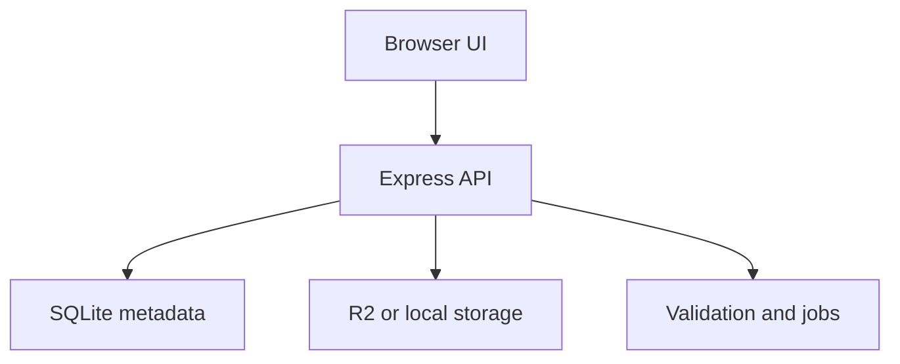

# Platform architecture

## Ownership

- Platform owns accounts, catalog/discovery, developer projects, publishing, retention data and the web UI.
- Player owns browser execution, sandbox, streaming and cache.
- Engine owns game runtime/build APIs and remains upstream of Player.
- Contracts contains only genuinely shared schemas/protocols.

Dependency direction remains `Platform → Player → Engine`.

## Current vertical slice

The browser validates in a Web Worker, uploads directly to the selected storage provider with progress/cancellation, then asks the API to complete validation. A ready version is published explicitly. The job atomically claims it, extracts safe files, persists the runtime URL and exposes only extracted assets through `/api/cdn/*`. Publishing archives the prior active release in the same transaction. Non-document R2 assets can use a gated short-lived signed redirect; executable documents stay behind the Platform proxy.

`DatabaseProvider`, `StorageProvider` and `JobQueue` define replaceable boundaries. The concrete implementation in this repository is still single-host SQLite. Queue records, atomic claims, worker leases and rate-limit buckets are persisted in that database, so multiple local workers share state; multi-host deployment still requires the PostgreSQL provider.

## Job execution

- `inline`: used by credential-free local development and E2E; the request runs configured retries immediately.
- `async`: workers poll durable SQLite jobs with atomic claims and expiring leases. This supports crash recovery on one host but is not a multi-host queue.

Jobs are deduplicated by type and target. Publish state is claimed atomically; extraction is idempotent because the version prefix is cleared before each attempt.

## Frontend loading

Player routes, developer dashboard, GamePlayer, editor and Firebase SDK are lazy-loaded. This keeps the large editor/worker out of the initial landing page while preserving the existing Engine-owned editor integration.

External-storage publishing, distributed services and monetization are roadmap items, not active dashboard features. See `PLATFORM_IMPLEMENTATION_PLAN.md` and `ARCHITECTURE_GAPS.md`.
