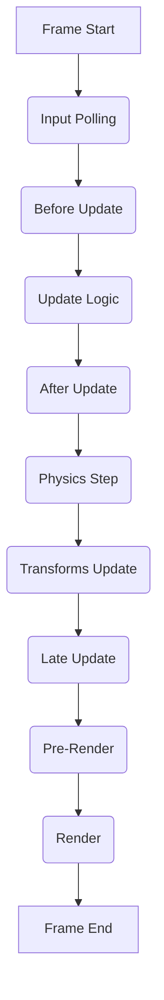

# Foundry Engine Constitution

This document outlines the strict architectural rules and frame execution order for the Foundry Engine.

## Strict Frame Execution Order

The engine uses a rigorous TaskScheduler to manage the execution order of all frame operations. This ensures predictable state, minimizes race conditions, and guarantees consistent rendering.

### Execution Stages

1. **Input Polling**: Collect all input events from the OS/Browser and update input state objects (Keyboard, Mouse, Gamepad).
2. **Before Update**: Early logic frame. Ideal for resetting frame-specific flags or interpolators.
3. **Update Logic**: The primary game logic step. Entity controllers, AI, and game rules evaluate here.
4. **After Update**: Logic that must run immediately after primary update (e.g., camera follow logic preparing for physics).
5. **Physics Step**: Physics simulation executes. Collisions are resolved, and rigidbodies move.
6. **Transforms Update**: Global transforms are recalculated based on local transforms and hierarchy. This step guarantees that world matrices are accurate before rendering.
7. **Late Update**: Final logic step. Typically used for UI updates or final camera adjustments based on exact resolved physics and transforms.
8. **Pre-Render**: Culling, batching, and draw-list construction.
9. **Render**: The actual WebGL/Canvas draw calls.
